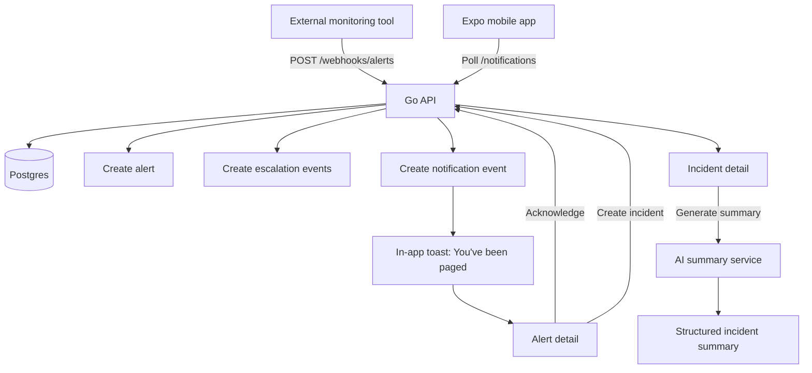

# oncall-companion

OnCall Companion is a small full-stack mobile demo for responding to production alerts from a phone.

The demo models a realistic on-call flow: an external monitoring system sends an alert webhook, the current on-call engineer receives a simulated page, acknowledges the alert, creates an incident, and uses a structured AI summary to communicate next steps.

I built it to explore mobile UX for high-pressure engineering workflows: making the first action obvious, keeping context concise, and using AI as an assistive layer rather than a generic chatbot.

## Demo flow

```txt
Webhook
→ simulated page
→ acknowledge alert
→ create incident
→ incident timeline
→ AI summary
```

## Stack

- Expo, React Native, TypeScript, and Expo Router for the mobile app
- TanStack Query for server state
- OpenAPI, `openapi-typescript`, and `openapi-fetch` for typed API contracts
- Go, chi, and pgxpool for the backend API
- Postgres for persistence
- Docker Compose for local infrastructure

## Running locally

The repo is being built in phases. The local commands are already sketched out in the root `Makefile`, but not every command is runnable until the matching backend and mobile phases land.

Planned commands:

```bash
make dev
make api
make mobile
make generate-client
make test-alert
```

## Product tradeoffs

- Push notifications are intentionally simulated with local notification events and an in-app toast so the project stays easy to run without APNs, Expo push tokens, or device-specific setup.
- Authentication is intentionally omitted at first. The backend will use a fixed demo user so the project stays focused on the incident response workflow.
- The AI summary is structured rather than conversational. It returns validated incident context, suggested actions, and draft communications. If no API key is configured, the backend returns deterministic fallback output.

## Architecture



## Disclaimer

This is an independent product-engineering demo inspired by incident response and on-call workflows. It is not affiliated with, endorsed by, or connected to incident.io.
